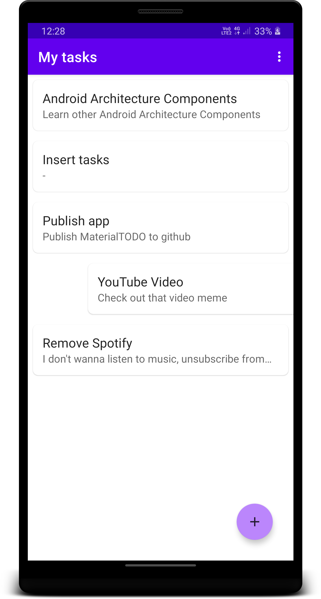
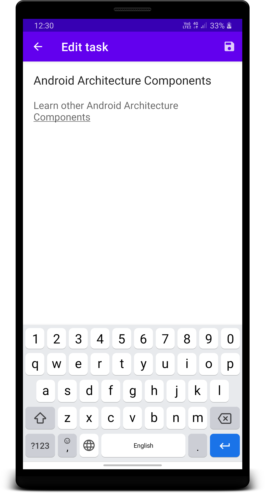
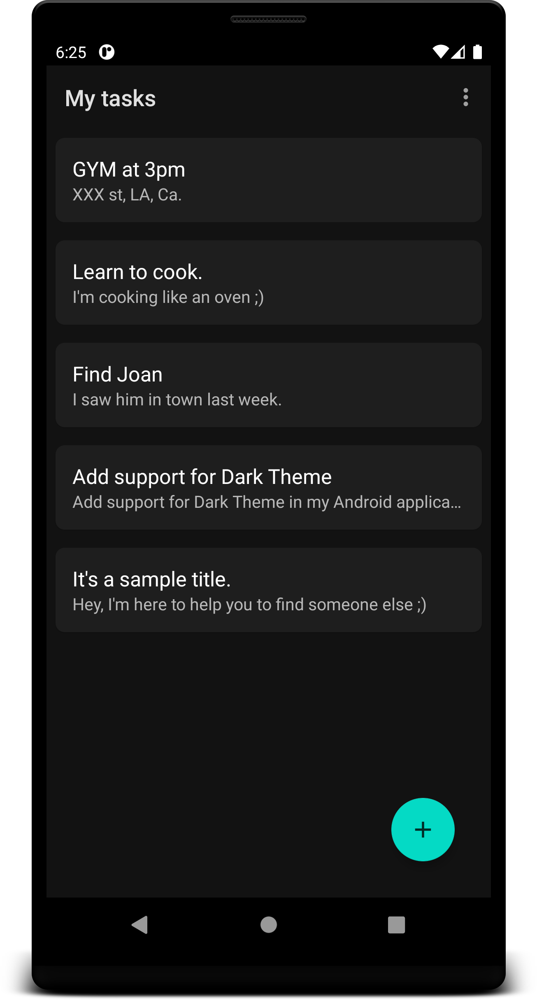

# MaterialTODO
_Here is it_

  
  
  

  

_MaterialTODO - a simple MVVM TODO application._

 * Name - MaterialTODO
 * Android 5.0 (API 21) or higher
 * Developer - Danil Ochagov [(ochagovdanil)](https://github.com/ochagovdanil)

# Getting Started
_Follow these instructions to build and run the project_

 1. Clone this repository.
 2. Download the appropriate [JDK](https://www.oracle.com/technetwork/java/javase/downloads/index.html) for your system.
 3. If you haven't Android Studio you need to [install it](https://developer.android.com/studio/).
 4. Open Android Studio, click `Open an existing Android Studio project` and select the project. Gradle will build the project.
 5. Run the app. Click `Run > Run 'app'`. After the project builds you'll be prompted to build or launch an emulator.
